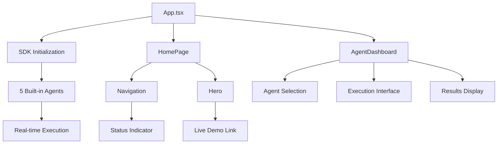

# How It Works: Cronos AI Agent SDK Integration

## 🏗️ Architecture Overview

The examplebolt application demonstrates a complete integration of the Cronos AI Agent SDK with a modern React application, showcasing how AI agents can be seamlessly embedded into existing web interfaces.

## 📁 Component Structure

```
examplebolt/
├── src/
│   ├── App.tsx                    # Main app with SDK initialization
│   ├── components/
│   │   ├── AgentDashboard.tsx     # Live agent execution interface
│   │   ├── Navigation.tsx         # Navigation with SDK status
│   │   └── Hero.tsx              # Landing page with live demo link
│   └── pages/
│       ├── HomePage.tsx          # Marketing site with SDK integration
│       └── UserStoriesPage.tsx   # Technical documentation
```

## 🔄 Application Flow

### 1. **SDK Initialization** (`App.tsx`)
```typescript
// Initialize SDK with all 5 built-in agents
const sdkInstance = new SentinelAgentSDK({
  network: 'cronos-testnet',
  rpcUrl: 'https://evm-t3.cronos.org',
  privateKey: 'demo-key'
});

// Register all built-in agents
sdkInstance.registerAgent('risk-monitor', new RiskMonitor());
sdkInstance.registerAgent('liquidity-optimizer', new LiquidityOptimizer());
sdkInstance.registerAgent('emergency-brake', new EmergencyBrake());
sdkInstance.registerAgent('threshold-guard', new ThresholdGuard());
sdkInstance.registerAgent('anomaly-detector', new AnomalyDetector());
```

### 2. **State Management**
- **SDK Instance**: Shared across components via props
- **Ready State**: Tracks initialization status
- **Agent Results**: Real-time execution results

### 3. **Component Integration**

#### **Navigation Component**
- Displays SDK connection status (green/gray dot)
- Provides dashboard access link
- Shows real-time agent availability

#### **Hero Component**
- Live SDK status indicator
- Direct link to agent dashboard
- Real-time connection feedback

#### **Agent Dashboard**
- Interactive agent selection interface
- Real-time agent execution
- Results display with JSON formatting
- Agent type classification (Deterministic/Statistical)

## 🤖 Agent Integration

### **Built-in Agents Available**
1. **Risk Monitor** (Deterministic) - Risk assessment and protective actions
2. **Liquidity Optimizer** (Deterministic) - Market-based liquidity allocation
3. **Emergency Brake** (Deterministic) - Critical threshold emergency stops
4. **Threshold Guard** (Deterministic) - Operation limit enforcement
5. **Anomaly Detector** (Statistical) - Z-score pattern analysis

### **Agent Execution Flow**
```typescript
const result = await sdk.executeAgent(selectedAgent, {
  contractId: 'demo-contract',
  user: '0x123...',
  customData: {
    balance: Math.random() * 100000,
    threshold: 10000,
    price: Math.random() * 1000,
    liquidity: Math.random() * 50000
  }
});
```

## 🎯 Key Features

### **Real-time Status**
- SDK initialization progress
- Agent availability indicators
- Connection status monitoring

### **Interactive Demo**
- Live agent execution
- Real-time result display
- Agent type classification
- JSON result formatting

### **Seamless Integration**
- Marketing site + technical demo
- Consistent navigation
- Professional UI/UX
- Mobile responsive design

## 🚀 Site Loading Process

### **Phase 1: Initial Load**
1. React app initializes
2. Router sets up navigation
3. SDK initialization begins in background

### **Phase 2: SDK Setup**
1. SentinelAgentSDK instance created
2. All 5 built-in agents registered
3. Ready state updated across components

### **Phase 3: Component Updates**
1. Navigation shows green status dot
2. Hero displays "SDK Ready - 5 Agents Active"
3. Dashboard becomes fully interactive

### **Phase 4: Live Demo**
1. Users can select any of 5 agents
2. Execute agents with random test data
3. View real-time JSON results
4. See agent type classifications

## 🔗 Component Connections



## 💡 Benefits

- **Educational**: Shows SDK capabilities in action
- **Interactive**: Users can test agents immediately
- **Professional**: Production-ready UI/UX
- **Comprehensive**: Demonstrates all 5 built-in agents
- **Real-time**: Live status and execution feedback

This integration demonstrates how the Cronos AI Agent SDK can be seamlessly embedded into any React application, providing both marketing appeal and technical functionality.